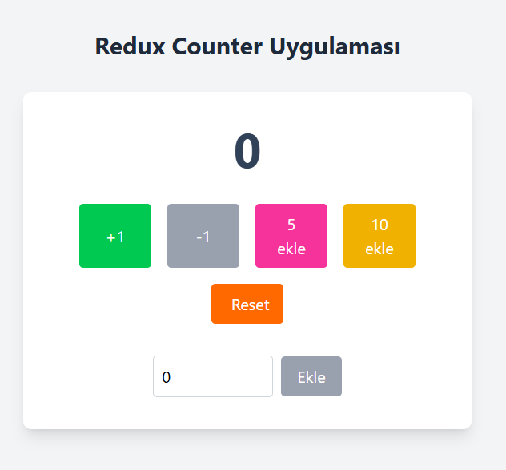

# 🔢 Redux Toolkit Counter Uygulaması

Bu proje, Redux Toolkit kullanımını öğrenmek ve pekiştirmek için tasarlanmış basit bir sayaç uygulamasıdır. Modern React, TypeScript ve Tailwind CSS teknolojileri kullanılarak geliştirilmiştir.

## 📱 Uygulama Görünümü



*Yukarıdaki görsel, uygulamanın ana arayüzünü göstermektedir. Temiz ve modern tasarımı ile kullanıcı dostu bir deneyim sunar.*

## 🎯 Proje Amacı

Bu proje ile Redux Toolkit'in temel kavramlarını öğrenebilirsiniz:

- **State Management**: Uygulama durumunu merkezi olarak yönetme
- **Actions & Reducers**: Durum değişikliklerini tanımlama ve işleme
- **Store Configuration**: Redux store'unu yapılandırma
- **Hooks Integration**: React hooks ile Redux entegrasyonu
- **TypeScript Support**: Tip güvenliği ile geliştirme

## 🚀 Özellikler

### Sayaç İşlemleri
- ➕ **+1**: Sayaç değerini 1 artırır
- ➖ **-1**: Sayaç değerini 1 azaltır (0'dan küçük olamaz)
- 🔄 **Reset**: Sayaç değerini 0'a sıfırlar
- 🎯 **5 Ekle**: Sayaç değerini 5 artırır
- �� **10 Ekle**: Sayaç değerini 10 artırır
- ✏️ **Özel Değer**: Kullanıcının girdiği değeri ekler

### Teknik Özellikler
- 🎨 **Modern UI**: Tailwind CSS ile responsive tasarım
- 🔒 **Type Safety**: TypeScript ile tip güvenliği
- ⚡ **Performance**: Redux Toolkit'in optimize edilmiş yapısı
- 🧪 **Best Practices**: Redux Toolkit'in önerdiği en iyi uygulamalar

## ��️ Teknoloji Stack'i

| Teknoloji | Versiyon | Açıklama |
|-----------|----------|----------|
| **React** | ^19.1.1 | UI kütüphanesi |
| **TypeScript** | ~5.8.3 | Tip güvenliği |
| **Redux Toolkit** | ^2.9.0 | State management |
| **React Redux** | ^9.2.0 | React-Redux entegrasyonu |
| **Tailwind CSS** | ^4.1.13 | CSS framework |
| **Vite** | ^7.1.2 | Build tool |

## 📦 Kurulum

### Gereksinimler
- Node.js (v16 veya üzeri)
- npm veya yarn

### Adımlar

1. **Projeyi klonlayın:**
```bash
git clone <repository-url>
cd redux-counter-example
```

2. **Bağımlılıkları yükleyin:**
```bash
npm install
```

3. **Geliştirme sunucusunu başlatın:**
```bash
npm run dev
```

4. **Tarayıcıda açın:**
```
http://localhost:5173
```
<code_block_to_apply_changes_from>
```
src/
├── redux/
│   ├── store.ts          # Redux store yapılandırması
│   └── counterSlice.ts   # Counter slice (actions & reducers)
├── App.tsx               # Ana uygulama bileşeni
├── main.tsx              # Uygulama giriş noktası
└── index.css             # Global stiller
```

