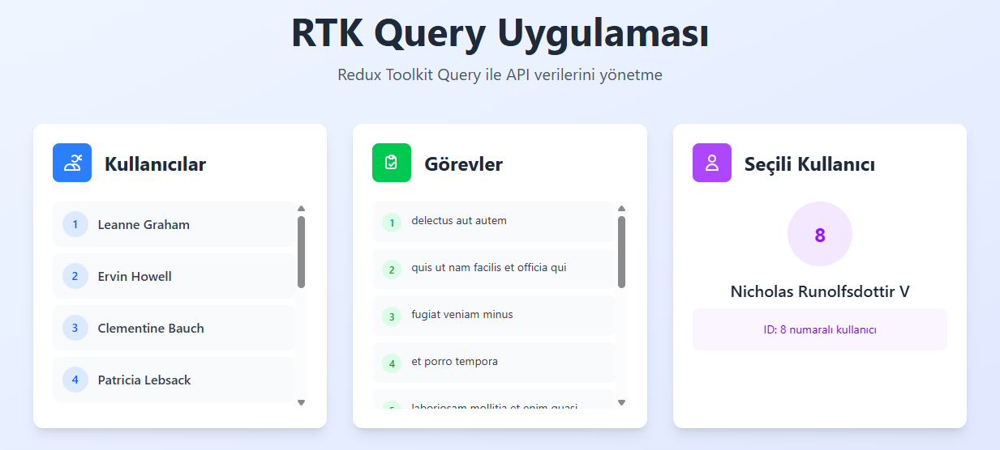

# 🚀 RTK Query Uygulaması

Bu proje, Redux Toolkit Query (RTK Query) kullanarak API veri yönetimi ve state management'ın nasıl yapıldığını gösteren modern bir React uygulamasıdır. [JSONPlaceholder API](https://jsonplaceholder.typicode.com/)'sinden kullanıcı ve görev verilerini çekerek, modern UI/UX tasarımı ile sunar.

## 📱 Uygulama Görünümü



*Yukarıdaki görsel, uygulamanın ana arayüzünü göstermektedir. Modern kart tasarımı ile kullanıcılar, görevler ve seçili kullanıcı bilgileri görüntülenmektedir.*

## 🎯 Proje Amacı

Bu proje ile RTK Query'nin temel kavramlarını öğrenebilirsiniz:

- **API Data Fetching**: Asenkron veri çekme işlemleri
- **Caching**: Otomatik veri önbellekleme
- **Loading States**: Yükleme durumlarını yönetme
- **Error Handling**: Hata durumlarını ele alma
- **TypeScript Integration**: Tip güvenliği ile API yönetimi
- **Modern UI/UX**: Tailwind CSS ile responsive tasarım

## 🔧 Ana İşlemler

### API Slice Oluşturma
`createApi` ile [JSONPlaceholder API](https://jsonplaceholder.typicode.com/)'si için bir API slice tanımlanmış. Bu slice, tüm API endpoint'lerini ve yapılandırmalarını içerir.

### Endpoint Tanımlama
Users ve Todos için GET endpoint'leri oluşturulmuş:
- **getUsers**: Tüm kullanıcıları getirir
- **getTodos**: Tüm görevleri getirir  
- **getUser**: Belirli bir kullanıcıyı ID'ye göre getirir

### Auto-Generated Hooks
RTK Query otomatik olarak aşağıdaki hook'ları üretmiş:
- `useGetUsersQuery()` - Kullanıcı listesi için
- `useGetTodosQuery()` - Görev listesi için
- `useGetUserQuery(id)` - Belirli kullanıcı için

### Store Konfigürasyonu
Redux store'a API reducer'ı ve middleware'i eklenmiş:
- API reducer'ı store'a entegre edilmiş
- RTK Query middleware'i yapılandırılmış
- Asenkron işlemler için middleware kullanılmış

### Component'ta Veri Çekme
React component'ında bu hook'lar kullanılarak API'dan veri çekilmiş:
- Loading state'leri otomatik yönetilir
- Error handling built-in olarak gelir
- Veriler otomatik olarak cache'lenir

## 🚀 Özellikler

### API Veri Yönetimi
- 👥 **Kullanıcılar**: [JSONPlaceholder](https://jsonplaceholder.typicode.com/)'dan kullanıcı listesi
- ✅ **Görevler**: Todo listesi verileri
- �� **Seçili Kullanıcı**: Belirli bir kullanıcının detayları
- ⚡ **Otomatik Caching**: RTK Query'nin built-in önbellekleme
- 🔄 **Background Refetching**: Arka plan veri yenileme

### Teknik Özellikler
- 🎨 **Modern UI**: Tailwind CSS ile responsive tasarım
- 🔒 **Type Safety**: TypeScript ile tip güvenliği
- ⚡ **Performance**: RTK Query'nin optimize edilmiş yapısı
- 🧪 **Best Practices**: RTK Query'nin önerdiği en iyi uygulamalar
- 📱 **Responsive**: Mobil ve desktop uyumlu

## ��️ Teknoloji Stack'i

| Teknoloji | Versiyon | Açıklama |
|-----------|----------|----------|
| **React** | ^19.1.1 | UI kütüphanesi |
| **TypeScript** | ~5.8.3 | Tip güvenliği |
| **Redux Toolkit** | ^2.9.0 | State management |
| **RTK Query** | ^2.9.0 | API data fetching |
| **React Redux** | ^9.2.0 | React-Redux entegrasyonu |
| **Tailwind CSS** | ^4.1.13 | CSS framework |
| **Vite** | ^7.1.2 | Build tool |

## 📦 Kurulum

### Gereksinimler
- Node.js (v16 veya üzeri)
- npm veya yarn

### Adımlar

1. **Projeyi klonlayın:**
```bash
git clone <repository-url>
cd rtk-query-example
```

2. **Bağımlılıkları yükleyin:**
```bash
npm install
```

3. **Geliştirme sunucusunu başlatın:**
```bash
npm run dev
```

4. **Tarayıcıda açın:**

## 🏗️ Proje Yapısı
src/
├── api/
│ └── api.ts # RTK Query API tanımlamaları
├── redux/
│ └── store.ts # Redux store yapılandırması
├── App.tsx # Ana uygulama bileşeni
├── main.tsx # Uygulama giriş noktası
└── index.css # Global stiller

## 🔍 Redux DevTools

Redux DevTools Extension'ı yükleyerek RTK Query'nin cache yönetimini ve API isteklerini gerçek zamanlı olarak izleyebilirsiniz:

1. [Chrome Extension](https://chrome.google.com/webstore/detail/redux-devtools/lmhkpmbekcpmknklioeibfkpmmfibljd)
2. [Firefox Add-on](https://addons.mozilla.org/en-US/firefox/addon/reduxdevtools/)

## 📊 API Endpoints

Bu proje [JSONPlaceholder API](https://jsonplaceholder.typicode.com/)'sini kullanır:

- **GET /users** - Kullanıcı listesi (10 kullanıcı)
- **GET /todos** - Görev listesi (200 görev)
- **GET /users/{id}** - Belirli kullanıcı detayları

**JSONPlaceholder Özellikleri:**
- Ücretsiz fake REST API
- Ayda ~3 milyar istek sunuyor
- Test ve prototipleme için ideal
- Tüm HTTP metodları destekleniyor

## 📚 Ek Kaynaklar

- [RTK Query Resmi Dokümantasyonu](https://redux-toolkit.js.org/rtk-query/overview)
- [Redux Toolkit Query Guide](https://redux-toolkit.js.org/rtk-query/usage/usage-with-typescript)
- [React Redux Hooks](https://react-redux.js.org/api/hooks)
- [JSONPlaceholder API](https://jsonplaceholder.typicode.com/)
