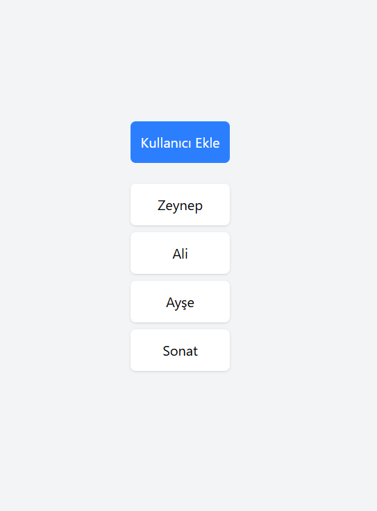

# �� RTK Query Mutation Uygulaması

Bu proje, Redux Toolkit Query (RTK Query) kullanarak **mutation** işlemlerinin nasıl yapıldığını gösteren modern bir React uygulamasıdır. JSON Server ile yerel API oluşturarak kullanıcı ekleme ve listeleme işlemlerini gerçekleştirir.

## 📱 Uygulama Görünümü



*Yukarıdaki görsel, uygulamanın ana arayüzünü göstermektedir. Merkezi hizalanmış tasarım ile "Kullanıcı Ekle" butonu ve kullanıcı listesi görüntülenmektedir.*

## 🎯 Proje Amacı

Bu proje ile RTK Query Mutation'ın temel kavramlarını öğrenebilirsiniz:

- **Mutation Operations**: POST işlemi yap
- **Cache Invalidation**: Veri değişikliklerinde cache'i güncelleme
- **Tag-based Caching**: Tag sistemi ile akıllı cache yönetimi
- **Loading States**: Mutation işlemlerinde yükleme durumları
- **Local API**: JSON Server ile yerel API geliştirme
- **Modern UI/UX**: Tailwind CSS ile responsive tasarım

## 🚀 Özellikler

### Mutation İşlemleri
- **POST /users** isteği gönderir
- **Yeni kullanıcı ekler**
- **Cache Invalidation**: "Users" etiketli cache'i geçersiz kılar
- **Otomatik olarak** kullanıcı listesi yenilenir

## 🔄 Cache Yönetimi Sistemi

### providesTags vs invalidatesTags

| Özellik | Ne İşe Yarar | Kullanım |
|---------|---------------|----------|
| **providesTags** | Cache'e etiket ekler | Query'lerde kullanılır |
| **invalidatesTags** | Cache'i geçersiz kılar | Mutation'larda kullanılır |

### Akış:

1. **getUsers çalışır** → Cache'e "Users" etiketi ile veri saklar
2. **addUser çalışır** → Yeni kullanıcı ekler
3. **invalidatesTags: ["Users"]** → Cache'i geçersiz kılar
4. **Otomatik olarak** getUsers yeniden çalışır


##️ Teknoloji Stack'i

| Teknoloji | Versiyon | Açıklama |
|-----------|----------|----------|
| **React** | ^19.1.1 | UI kütüphanesi |
| **TypeScript** | ~5.8.3 | Tip güvenliği |
| **Redux Toolkit** | ^2.9.0 | State management |
| **RTK Query** | ^2.9.0 | API data fetching & mutations |
| **React Redux** | ^9.2.0 | React-Redux entegrasyonu |
| **Tailwind CSS** | ^4.1.13 | CSS framework |
| **JSON Server** | ^1.0.0-beta.3 | Yerel API server |
| **Concurrently** | ^9.2.1 | Paralel script çalıştırma |
| **Vite** | ^7.1.2 | Build tool |

## 📦 Kurulum

### Gereksinimler
- Node.js (v16 veya üzeri)
- npm veya yarn

### Adımlar

1. **Projeyi klonlayın:**
```bash
git clone <repository-url>
cd rtk-query-mutation
```

2. **Bağımlılıkları yükleyin:**
```bash
npm install
```

3. **Geliştirme sunucusunu başlatın:**
```bash
npm run dev
```

Bu komut aynı anda:
- JSON Server'ı port 3002'de başlatır
- Vite development server'ı başlatır

4. **Tarayıcıda açın:**

## 🏗️ Proje Yapısı
src/
├── db/
│ └── db.json # JSON Server veritabanı
├── api.ts # RTK Query API tanımlamaları
├── App.tsx # Ana uygulama bileşeni
├── main.tsx # Uygulama giriş noktası
└── index.css # Global stiller
